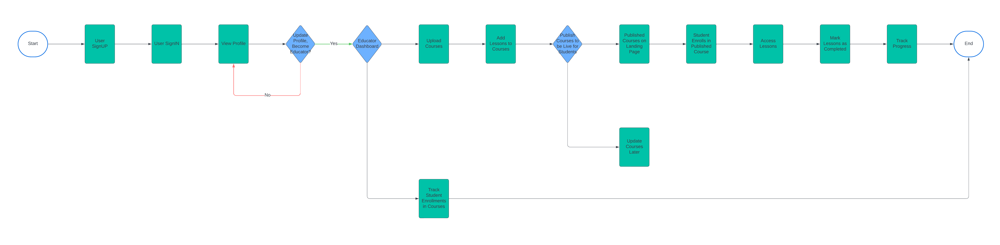
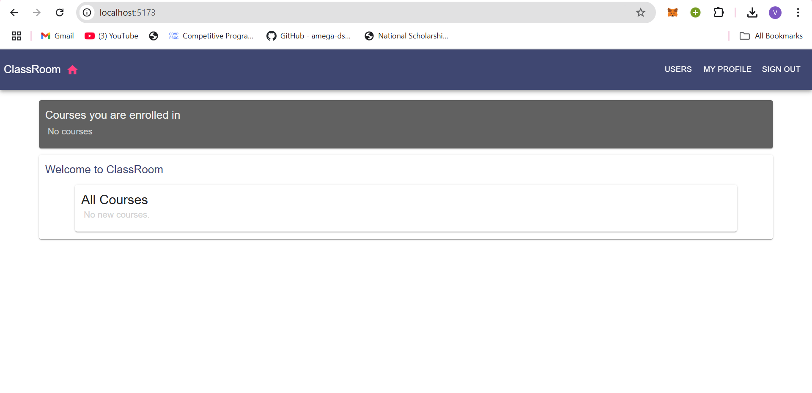
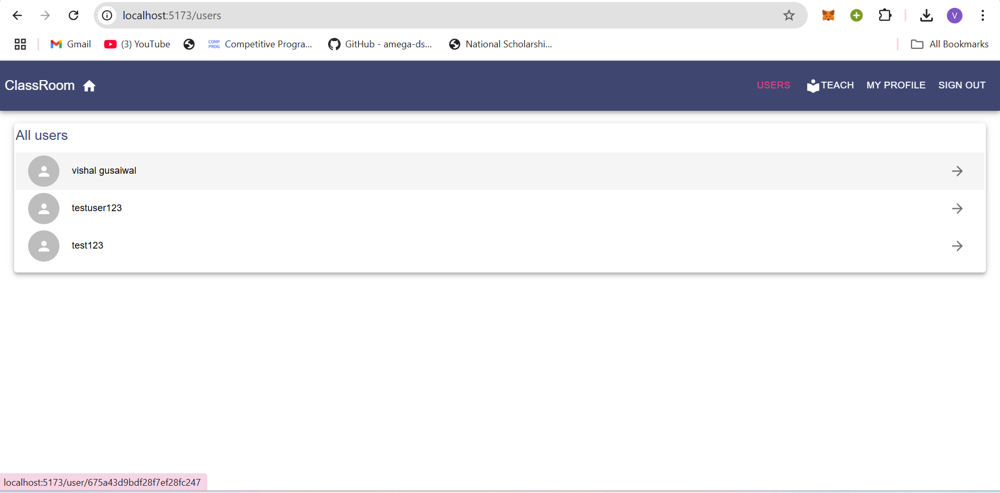
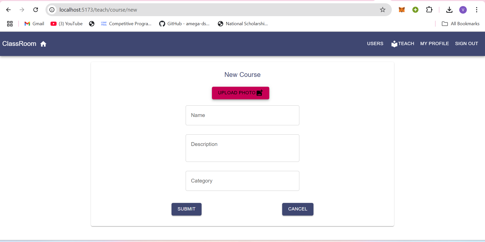

# ClassRoom Application

The **ClassRoom Application** is a web-based platform designed to facilitate educational management. It allows **educators** and **students** to interact in an online environment with features like course creation, enrollment, and progress tracking. The application provides **role-based access** for teachers and students, ensuring that users have tailored experiences based on their roles.

## Features

### 1. **Role-based Access**
- **Educators** can upload and manage courses, publish them for students, and track enrollment.
- **Students** can browse published courses, enroll, and track their progress through lessons.

### 2. **Course and Lesson Management**
- Teachers can easily create courses and add lessons to them.
- After publishing, courses are visible to students who can enroll and begin learning.

### 3. **Progress Tracking**
- Students can mark lessons as **completed** and track their overall progress within the course.
- Educators can monitor the number of students enrolled in each course and their progress.

### 4. **User Authentication**
- Users can **sign up** and **sign in** to the platform to view their profiles, courses, and progress.
- Students can update their profiles, while educators can switch roles for managing courses.

## Technology Stack

- **Frontend**: React.js, Material UI
- **Backend**: Node.js, Express.js, MongoDB
- **Deployment**: AWS, PM2, NGINX

## Purpose & Motivation

The **ClassRoom Application** was developed to create a simple yet effective way to manage courses and track student progress. With an increasing need for educational management tools in online learning environments, this project provides a foundational structure for educators and students to engage with the content and monitor their learning outcomes effectively.

## Future Enhancements

- Integration of **live class features** (video streaming, real-time communication).
- Addition of **quizzes** and **assignments** to track deeper student engagement.
- Enhanced **reporting tools** for both students and teachers to analyze performance.

  
Flow Chart

Landing Page of Application

Some basic Flows
All Users

Course Addition

